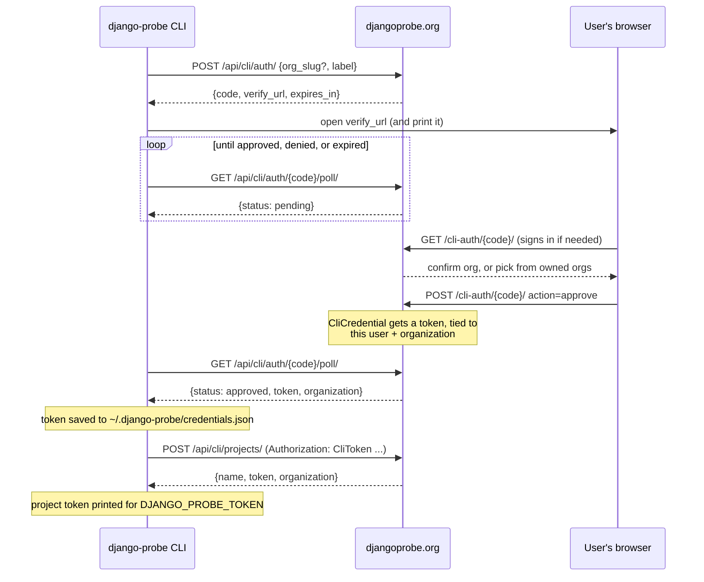

# Architecture

This repository builds two separate things from one source tree.

## `django_probe`

This is the Python package that is installed into Django projects and reports aggregate information. Each probe walks the standard library `ast` module's parse tree.

| File | Role |
|---|---|
| `main.py` | CLI entry point. |
| `probes/` | Individual probes. |

## djangoprobe.org

The central Django application that receives submissions, hosted at [djangoprobe.org](https://djangoprobe.org/).

## How a submission flows

1. `django-probe scan` walks the project and runs every registered probe, producing a
   `{key: count}` payload via `payload.py`.
2. `django-probe submit` sends that payload, plus `probe_sources`, to the ingest
   server's `views.py`.
3. `validation.py` checks shape, and the raw submission is stored as-is. See
   [Third-party probe packages](third-party-probes.md) for why nothing gets normalized or described at this point.

## How `login` and `init` work

A lightweight, first-party device-authorization flow — not full OAuth, since the
CLI and web app are both ours. `login.py` and `init.py` talk to `views.py`'s
`cli_auth_start`/`cli_auth_poll`/`cli_projects_create`; the browser side is
`cli_auth_verify`. A `CliCredential` row (`models.py`) is both the short-lived
login request and, once approved, the long-lived credential `init` uses.

